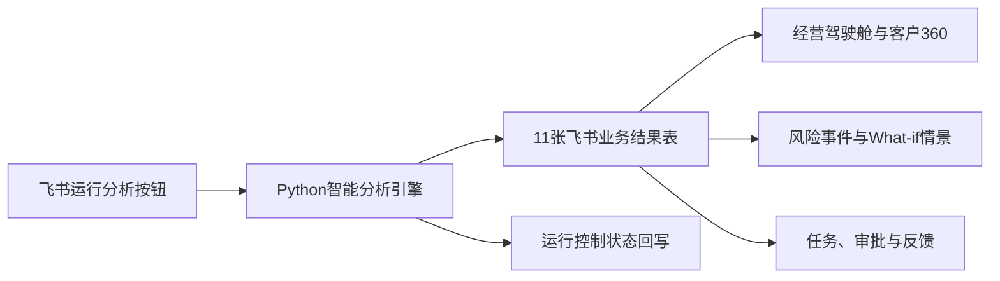

# 渠智罗盘（Channel Compass）

> AI先锋未来人才大赛40强赛作品｜长虹佳华“AI渠道经营分析”命题

面向ICT分销场景的渠道健康度评估与“库存—回款”双风险决策支持原型。系统以Python智能分析引擎连接飞书多维表格、AI能力、自动化和工作流，形成从风险识别到人工处置反馈的完整闭环。

项目将分散的销售、库存、应收与回款信息组织为可追溯经营链，通过模型排序、动态到期规则、五维健康诊断和What-if情景测算，把“发现风险”转化为可解释、可审批、可反馈的处置任务。

> 本仓库是大学生创新比赛原型，不是企业生产系统。公开版本只包含源代码、测试、合成数据和便携演示；企业提供的脱敏模拟数据、企业级派生明细及训练模型均未上传。

## 作品速览

```text
企业数据 → 数据审计 → 冻结模型与业务规则 → 客户健康诊断
→ 风险事件与证据 → What-if情景 → 飞书任务与审批 → 反馈回流
```

在赛事提供的脱敏模拟数据环境中，当前版本已经完成：

| 已验证成果 | 当前结果 |
|---|---:|
| 冻结模型订单评分 | 87,341笔 |
| 客户五维健康画像 | 60个 |
| 风险事件 / 红色处置任务 | 42条 / 29条 |
| 测试集PR-AUC / ROC-AUC | 0.581 / 0.924 |
| 测试集召回率 | 84.3% |
| Top20%风险金额捕获率 | 93.39% |
| 飞书数据层 | 11张业务结果表＋1张运行控制表 |
| 自动化测试 | 65项通过 |

上述指标用于证明比赛原型的数据链路、风险排序和工程闭环，不代表长虹佳华真实经营水平或已实现的企业收益。企业派生报告不在公开仓库中，完整审计证据随比赛提交包提供。

## 产品形态



- **分析后端**：数据审计、特征工程、冻结模型推理、动态到期规则、库存健康、五维诊断和What-if测算；
- **飞书数据层**：按稳定编号增量同步11张业务结果表，单独维护第12张运行控制表；
- **飞书应用前端**：经营驾驶舱、客户360、风险事件中心、What-if情景预演、处置中心、库存风险专题和系统运行中心；
- **人机协同**：飞书AI只解释结构化证据，授信、停发、催收升级和法务动作必须由业务人员审批。

> 为避免公开脱敏客户明细、成员个人信息或临时访问地址，完整飞书应用截图和交互视频不直接放入公开仓库；评委版方案和Demo视频提供经过裁剪的界面展示。

## 项目解决什么问题

ICT分销同时面临货物流与资金流风险：销售增长可能伴随库存积压，应收扩大也可能掩盖迟付和信用暴露。传统报表擅长说明“发生了什么”，渠智罗盘进一步回答：

- 哪些客户和订单需要优先关注？
- 风险由哪些经营证据推动？
- 客户当前处于临期还是哪一档超期阶段？
- 不处理、保守干预和平衡干预分别意味着什么？
- 风险如何转化为负责人、期限、审批和结果反馈？

## 核心闭环


系统采用“Python智能分析引擎＋飞书业务协同前端”的分层方案：Python负责清洗、建模、评分和结构化结果；飞书多维表格应用负责驾驶舱、客户下钻、AI摘要、人员分派、审批和反馈回流。

## 核心能力

| 模块 | 当前原型能力 |
|---|---|
| 一链 | 统一客户、订单、SKU、库存、应收和回款编码，形成可回放经营链 |
| 回款风险 | 使用时间隔离与成熟标签训练订单级风险模型，并保留业务规则基线 |
| 动态到期 | 按到期前5天、超期1—30天、31—60天、61—120天、120天以上分层 |
| 五维健康度 | 营收质量、库存采购暴露、付款行为、信用暴露、合作稳定性 |
| 库存风险 | SKU—仓库库存健康与未来4/8周需求基线 |
| 双风险联动 | 识别客户近180天采购高库存风险SKU的暴露，不推断客户实际库存 |
| 三演 | 对不处理、保守干预、平衡干预进行透明参数化What-if测算 |
| 一单 | 生成包含风险、证据、金额、建议角色、期限和审批边界的处置任务 |
| 反馈闭环 | 人工记录方案、审批、执行结果和预警有效性，按稳定任务编号回流 |

## 快速体验

公开仓库默认运行完全合成的数据闭环，不需要企业原始数据。

### 1. 创建环境

```powershell
git clone https://github.com/Zero897/channel-compass.git
cd channel-compass
python -m venv .venv
& ".\.venv\Scripts\python.exe" -m pip install -r requirements-all.txt
```

### 2. 运行便携演示

```powershell
& ".\.venv\Scripts\python.exe" "src\run_portable_demo.py"
```

该命令会使用固定随机种子完成：

```text
生成合成交易 → 构造历史特征 → 时间切分 → 训练逻辑回归
→ 未来测试期评分 → 固定阈值生成风险事件 → 导出演示结果
```

输出位于 `demo_output/`：

- `raw_transactions.csv`：合成订单流水；
- `model_features.csv`：只使用历史信息构造的特征；
- `dashboard_risk_events.csv`：可用于页面展示的风险事件；
- `model_metrics.json`：训练/测试规模和演示评估结果。

便携演示用于证明代码链路可运行，其指标不代表企业真实效果。

### 3. 运行公开环境测试

```powershell
& ".\.venv\Scripts\python.exe" -m unittest `
  tests.test_pipeline `
  tests.test_portable_demo `
  tests.test_backend_api `
  tests.test_feishu_sync `
  tests.test_run_control_store `
  tests.test_run_service -v
```

企业报告、冻结模型和订单级评分文件未公开，因此公开仓库只运行上述合成数据与接口单元测试。授权数据环境生成完整产物后，可运行全部测试。

## 企业主链（授权数据环境）

在获得授权的数据环境中，将赛题数据放置于配置指定目录。日常分析使用冻结模型推理，不重新训练：

```powershell
& ".\.venv\Scripts\python.exe" "src\run_frozen_company_pipeline.py"
```

只有管理员需要重新训练、评估并冻结新模型时才运行：

```powershell
& ".\.venv\Scripts\python.exe" "src\run_company_pipeline.py"
```

企业主链依次执行：

1. 七表数据审计与常规分销/项目业务识别；
2. 固定120天观察期、时间隔离带和无泄漏特征构建；
3. 业务规则、逻辑回归与LightGBM比较、校准和验证集选模；
4. 客户风险聚合、风险事件、订单证据和处置任务生成；
5. SKU—仓库库存健康与未来4/8周需求基线；
6. 动态到期分层、五维健康度和客户采购风险暴露；
7. 三种透明处置情景；
8. 风险处置时间线与反馈回流。

原始数据目录、处理数据、企业派生结果和模型文件均由 `.gitignore` 排除。仓库中的配置只描述目录和原型参数，不包含访问密钥。

## 飞书应用

企业主链生成11张飞书业务结果表，覆盖客户、事件、任务、证据、情景、时间线、库存、模型指标、动态回款和客户商品暴露；第12张运行控制表由后端任务管理器单独回写。当前飞书应用已经实现：

- 经营驾驶舱；
- 客户360；
- 风险事件中心；
- What-if情景预演；
- 处置中心；
- 库存风险专题；
- 系统运行中心。

详细的字段类型、主外键、关联基数和自动化配置见[飞书十一表数据字典与自动化配置](docs/飞书十一表数据字典与自动化配置.md)和[飞书实施说明](docs/feishu_setup.md)。

## 飞书前端触发后端

安装后端依赖并启动本地异步服务：

```powershell
& ".\.venv\Scripts\python.exe" -m pip install -r requirements-all.txt
& ".\.venv\Scripts\python.exe" "src\backend_api.py"
```

服务提供`POST /api/runs`、`GET /api/runs/{run_id}`和`GET /api/health`。普通运行加载冻结模型推理，不重新训练；运行状态回写飞书`运行控制`表。字段配置、鉴权和安全开关见[飞书前端触发后端运行手册](docs/飞书前端触发后端运行手册.md)。

比赛演示可另开PowerShell窗口执行`cloudflared tunnel --url http://127.0.0.1:8000`生成临时HTTPS地址，再把`/api/runs`地址填入飞书HTTP自动化。临时地址重启后会变化。

## 项目结构

```text
channel-compass/
├─ config/                 # 数据契约、路径与原型参数
├─ data/
│  ├─ synthetic/          # 公开合成业务数据
│  ├─ mock_enterprise/    # 公开模拟三表数据
│  └─ feedback/           # 人工反馈模板
├─ demo_output/            # 便携演示结果
├─ docs/                   # 产品、规则、数据字典与飞书说明
├─ src/                    # 数据、模型、风险和流程代码
├─ tests/                  # 自动化测试
├─ requirements-lock.txt   # 可复现依赖版本
└─ README.md
```

## 关键设计原则

- **时间无泄漏**：订单特征只能使用预测时点之前的信息，标签必须经过完整观察期。
- **模型与规则分工**：模型负责未到期订单风险排序；确定性逾期和到期阶段由业务规则处理。
- **解释先于动作**：业务界面优先展示风险分、证据和影响金额，不把概率包装成精确违约率。
- **人机协同**：AI只生成摘要和核查建议，授信、停发、催收升级及法务动作必须人工审批。
- **结果不虚构**：没有真实反馈时，不填充完成任务、处置收益或闭环率。
- **数据最小公开**：公开仓库不包含企业原始数据、客户级派生明细、企业训练模型或访问凭证。

## 口径与限制

- 企业验证使用的是赛事提供的脱敏模拟数据，不能外推为真实经营水平。
- 当前企业模型目标是订单出库后120天观察期内的超期风险，不是“未来30天坏账概率”。
- 风险加权应收暴露用于排序和比较，不等同于预期坏账损失。
- What-if模块是参数化决策辅助，不证明干预具有因果效果。
- 未来4周和8周需求是最近90天日均销量外推基线，不宣称为客户—SKU机器学习需求预测。
- 当前数据时效演示支持 `historical_replay` 与 `business_current` 两种模式；业务模式下，数据过期会触发门禁并停止生成当前临期结论。
- 当前未连接企业ERP、WMS或财务实时接口；生产架构可通过定时任务、事件订阅和飞书OpenAPI实现准实时同步。

## 延伸阅读

- [产品定位](docs/product_positioning.md)
- [数据字典](docs/data_dictionary.md)
- [动态到期规则卡](docs/dynamic_due_rule_card.md)
- [决策模块说明](docs/decision_modules.md)
- [原型目标复核](docs/prototype_alignment_review.md)

## 项目状态

当前比赛MVP已经完成数据链路、冻结风险模型、证据解释、情景测算、飞书11表增量同步、异步运行控制和人工处置闭环验证。进入真实业务环境前，仍需完成企业字段映射、阈值联合校准、固定后端部署、权限审批、4—6周影子运行和持续监控。
