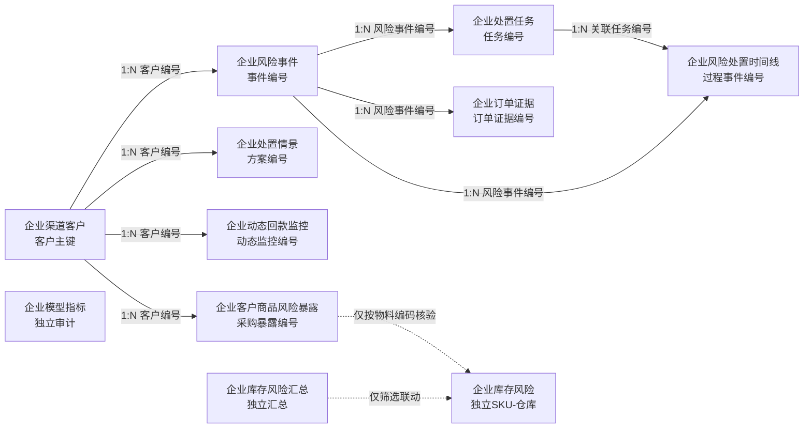

# 渠智罗盘：飞书十一表数据字典、关联关系与自动化配置

## 1. 使用范围

本文以 `data/exports/feishu/` 中2026-08-12完整企业主链生成的11张正式CSV为准。CSV由Python生成业务事实、模型结果和任务底稿；飞书负责关联、AI解释、人员分派、通知、审批和状态回写。

必须遵守三条边界：

1. Python是正式处置任务的唯一创建者，飞书自动化不得再次创建任务。
2. AI只能生成摘要和核查建议，不得自动调整授信、停止发货或进入法务流程。
3. 负责人、人工处置方案、审批结果、执行结果和预警有效性必须由人员确认，不得用演示值冒充真实业务结果。

## 2. 十一张表总览

| 序号 | 数据表 | 当前行数 | 主字段 | 主要用途 |
|---|---|---:|---|---|
| 1 | 企业渠道客户 | 60 | 客户主键 | 客户主档、应收风险和五维健康度 |
| 2 | 企业风险事件 | 42 | 事件编号 | 存量逾期、模型预警和到期提醒 |
| 3 | 企业处置任务 | 29 | 任务编号 | 风险处置、审批、执行与反馈 |
| 4 | 企业订单证据 | 13 | 订单证据编号 | 模型预警的订单级下钻证据 |
| 5 | 企业处置情景 | 81 | 方案编号 | 每个候选客户三种What-if方案 |
| 6 | 企业风险处置时间线 | 126 | 过程事件编号 | 风险发现到任务处置的过程记录 |
| 7 | 企业库存风险汇总 | 463 | 库存汇总编号 | 产品线—仓库—风险等级的全量汇总 |
| 8 | 企业库存风险 | 500 | 库存对象编号 | Top500 SKU—仓库库存风险明细 |
| 9 | 企业模型指标 | 40 | 指标编号 | 主模型、基线和消融模型审计 |
| 10 | 企业动态回款监控 | 73 | 动态监控编号 | 到期前5天和分档超期管理 |
| 11 | 企业客户商品风险暴露 | 1664 | 采购暴露编号 | 客户采购高库存风险SKU的暴露 |

### 飞书字段类型约定

- 编号、订单号、客户编号、物料编码：单行文本，不使用数字类型，避免前导零丢失。
- 金额：数字或货币，建议保留2位小数。
- 比例、概率：数字并设置为百分比；底层数据0.2表示20%。
- 评分：数字，范围0—100，建议保留1位小数。
- 日期：日期字段；当前CSV为 `YYYY-MM-DD`。
- 等级、阶段、状态：单选字段，严格使用本文给出的枚举。
- 证据、解释、摘要、方案：多行文本。
- 主字段和外部键不可改为公式或自动编号，否则重导入时无法稳定匹配。

## 3. 各表数据字典

### 3.1 企业渠道客户

主字段为“客户主键”；“客户编号”是所有客户相关表的外部关联键。客户统计口径为当前有应收、近180天有采购或存在风险事件的客户。

| 字段 | 飞书类型 | 口径与用途 |
|---|---|---|
| 客户主键 | 单行文本/主字段 | `客户编号｜客户名称`，用于飞书显示和去重 |
| 快照日期 | 日期 | 客户应收及健康诊断的数据基准日 |
| 客户编号 | 单行文本 | 稳定客户外部键，关联事件、情景、动态监控和采购暴露 |
| 客户名称 | 单行文本 | 客户展示名称 |
| 当前应收余额 | 货币 | 最新应收快照中的客户应收余额 |
| 逾期应收金额 | 货币 | 最新快照中已经逾期的应收金额 |
| 逾期30天以上金额 | 货币 | 超期天数大于30天的应收金额 |
| 逾期60天以上金额 | 货币 | 超期天数大于60天的应收金额 |
| 最大逾期天数 | 数字 | 客户当前应收中的最大超期天数 |
| 最早最终承诺还款日 | 日期 | 当前开放应收中最早的最终承诺还款日；无应收时可空 |
| 当前开放订单数 | 数字 | 最新快照中仍开放的销售订单数 |
| 预测高风险订单数 | 数字 | 冻结模型超过阈值的未到期开放订单数 |
| 预测高风险应收金额 | 货币 | 高风险开放订单对应的当前应收金额合计 |
| 风险加权应收暴露 | 货币 | 校准概率乘当前应收的排序指标，不等同预期坏账 |
| 最高模型概率 | 百分比 | 客户开放订单中的最高模型概率，仅用于审计 |
| 最高风险分 | 数字 | 客户开放订单中的最高0—100风险分 |
| 逾期占比 | 百分比 | 逾期应收金额÷当前应收余额 |
| 风险等级 | 单选 | 红色、黄色、绿色 |
| 风险来源 | 单选/文本 | 存量逾期、预测风险、近180天采购、风险事件补录等 |
| 数据来源 | 单行文本 | 数据来源及聚合链路标识 |
| 客户统计口径 | 多行文本 | 当前客户主表的纳入范围说明 |
| 试点范围命中 | 单选 | 是、否；只控制展示，不裁剪模型训练全集 |
| 试点品牌代理 | 单行文本 | 当前试点品牌代理字段 |
| 试点区域 | 单选/文本 | 当前试点区域或客户区域代理 |
| 营收质量分 | 数字 | 五维健康度的营收质量分，0—100 |
| 库存周转暴露分 | 数字 | 基于采购高库存风险商品暴露计算，越高越健康 |
| 付款行为分 | 数字 | 基于历史迟付率和逾期金额占比，0—100 |
| 信用暴露分 | 数字 | 基于当前逾期及风险加权应收暴露，0—100 |
| 合作稳定性分 | 数字 | 基于订单数、销售变化和展期记录，0—100 |
| 综合健康度 | 数字 | 五维透明加权诊断分，0—100 |
| 健康度等级 | 单选 | 红色、黄色、绿色；红色风险事件可强制覆盖 |
| 健康度证据 | 多行文本 | 五个分项的可下钻摘要 |
| 健康度口径 | 多行文本 | 说明健康度不是违约概率，库存维度是采购暴露 |
| 健康度版本 | 单行文本 | 当前评分版本，如 `health_score_v1` |
| 高库存风险商品采购金额 | 货币 | 近180天采购黄色或红色库存风险SKU的金额 |
| 高库存风险SKU数 | 数字 | 上述高库存风险SKU数量 |
| 高库存风险商品采购占比 | 百分比 | 高风险SKU采购金额÷近180天采购总额 |

飞书新增字段：由关联操作自动产生“风险事件（反向）”“处置情景（反向）”“动态回款（反向）”“采购暴露（反向）”，不应写回CSV。

### 3.2 企业风险事件

每行是一条结构化风险事实或预警。红色事件才生成正式处置任务；黄色到期提醒保留在事件表但不自动生成红色任务。

| 字段 | 飞书类型 | 口径与用途 |
|---|---|---|
| 事件编号 | 单行文本/主字段 | 稳定风险事件主键 |
| 客户编号 | 单行文本 | 关联企业渠道客户的外部键 |
| 客户名称 | 单行文本 | 事件客户展示名称 |
| 风险类型 | 单选 | 存量逾期应收、预测订单回款风险、到期前5天付款提醒等 |
| 风险等级 | 单选 | 红色、黄色、绿色 |
| 触发时间 | 日期/日期时间 | 规则或模型产生事件的运行时间 |
| 数据快照 | 日期 | 事件使用的数据基准日 |
| 关键指标 | 多行文本 | 风险金额、超期阶段、订单数等结构化证据摘要 |
| 风险金额 | 货币 | 当前事件直接影响金额 |
| 风险加权应收暴露 | 货币 | 仅模型事件填写的概率加权暴露 |
| 模型概率 | 百分比 | 仅模型事件填写；规则事件留空 |
| 风险分 | 数字 | 仅模型事件填写的0—100风险分 |
| 置信说明 | 多行文本 | 区分确定性规则、模型排序和证据边界 |
| 客户历史摘要 | 多行文本 | 当前应收、历史逾期、开放订单等客户背景 |
| 规则解释 | 多行文本 | 规则命中或模型事件形成原因 |
| AI风险摘要 | 多行文本 | 飞书AI生成；CSV默认留空，必须基于本行字段 |
| 建议动作 | 多行文本 | 系统建议的人工核查或处置方向 |
| 处理状态 | 单选 | 待处理、处理中、已完成、已关闭 |
| 模型版本 | 单行文本 | `business_rule`或冻结主模型名称 |
| 模型阈值 | 百分比 | 仅模型事件填写的冻结阈值 |
| data_source | 单行文本 | 数据和生成链路标识 |
| 业务类型 | 单选 | 常规消费品分销、企业级项目类 |
| 动态到期阶段 | 单选 | 未临期、到期前5天、超期1—30天、31—60天、61—120天、120天以上 |
| 客户履约等级 | 单选 | 履约稳定、需加强关注、履约较差、需人工复核 |
| 动态建议动作 | 多行文本 | 结合到期阶段和履约等级得到的建议 |
| 处置强度 | 单选 | 常规监测、提醒、催收、升级催收、停发审批、法务复核、严格管控 |
| 规则版本 | 单行文本 | 动态到期规则版本 |

飞书新增字段：`关联客户`（单条双向关联）、`通知状态`（未发送/已发送/发送失败）、`通知时间`（日期时间）。

### 3.3 企业处置任务

任务由Python按稳定任务编号生成。AI建议和人工方案必须分列，正式任务表当前不填写虚构负责人和执行结果。

| 字段 | 飞书类型 | 口径与用途 |
|---|---|---|
| 任务编号 | 单行文本/主字段 | 稳定任务主键 |
| 风险事件编号 | 单行文本 | 关联企业风险事件的外部键 |
| 客户编号 | 单行文本 | 冗余客户键，便于筛选与核验 |
| 客户名称 | 单行文本 | 任务客户展示名称 |
| AI建议动作 | 多行文本 | Python或AI提供的建议，不等同已批准方案 |
| 人工处置方案 | 多行文本 | 业务人员确认的实际方案；未确认时保留“待填写” |
| 负责人 | 人员 | 实际承接人员；CSV为空，导入后改为人员字段 |
| 创建时间 | 日期/日期时间 | 任务生成时间 |
| 截止日期 | 日期 | 任务SLA截止日期 |
| 审批状态 | 单选 | 待审批、已批准、已驳回 |
| 执行状态 | 单选 | 待处理、处理中、已完成、已关闭 |
| 完成时间 | 日期/日期时间 | 实际完成时间；完成前留空 |
| 实际回款金额 | 货币 | 经人工核验的实际回款；未发生时留空而不是填0 |
| 执行结果 | 多行文本 | 人工记录的执行结果和证据 |
| 预警有效性 | 单选 | 待确认、有效、部分有效、误报 |
| 反馈备注 | 多行文本 | 误报原因、客户背景和后续校准建议 |
| data_source | 单行文本 | 任务生成链路标识 |
| 风险类型 | 单选 | 从风险事件同步的风险类型 |
| 风险等级 | 单选 | 从风险事件同步的风险等级 |
| 风险分 | 数字 | 模型事件风险分；规则事件可空 |
| 影响金额 | 货币 | 从事件同步的风险金额 |
| 关键证据 | 多行文本 | 从事件同步的关键指标 |
| 置信说明 | 多行文本 | 从事件同步的证据边界 |
| 业务类型 | 单选 | 常规消费品分销、企业级项目类 |
| 动态到期阶段 | 单选 | 当前到期或超期阶段 |
| 客户履约等级 | 单选 | 当前客户履约等级 |
| 处置强度 | 单选 | 当前建议管控强度 |
| 审批建议 | 多行文本 | 是否必须人工审批及系统权限边界 |
| 建议负责人角色 | 单选/文本 | 客户经理、财务、信用管理、法务等岗位建议 |
| SLA状态 | 单选 | SLA内待处理、即将到期、已超期、已完成 |

飞书新增字段：`关联风险事件`（单条双向关联）。如需过程留痕，可增加系统字段“最后更新时间”和“修改人”。

### 3.4 企业订单证据

只为模型预测事件保留Top订单证据，用于解释“是哪几笔订单和哪些历史特征推动风险排序”。

| 字段 | 飞书类型 | 口径与用途 |
|---|---|---|
| 订单证据编号 | 单行文本/主字段 | 稳定证据主键 |
| 风险事件编号 | 单行文本 | 关联模型风险事件的外部键 |
| 客户编号 | 单行文本 | 冗余客户键，用于核验 |
| 销售订单号 | 单行文本 | 企业销售订单号，不使用数字字段 |
| 出库日期 | 日期 | 订单出库日期 |
| 风险分 | 数字 | 订单0—100风险分 |
| 风险概率 | 百分比 | 冻结模型校准输出，仅作排序和加权 |
| 当前应收金额 | 货币 | 订单对应当前开放应收 |
| 风险加权应收暴露 | 货币 | 风险概率×当前应收 |
| 关键证据 | 多行文本 | 订单级重要特征及方向性贡献 |

飞书新增字段：`关联风险事件`（单条双向关联）。

### 3.5 企业处置情景

当前为27个候选客户×3种方案，共81行；属于参数化What-if，不代表干预的真实因果效果。

| 字段 | 飞书类型 | 口径与用途 |
|---|---|---|
| 方案编号 | 单行文本/主字段 | 客户与情景组合的稳定主键 |
| 客户编号 | 单行文本 | 关联企业渠道客户的外部键 |
| 客户名称 | 单行文本 | 客户展示名称 |
| 方案名称 | 单选/文本 | 不处理、保守干预、平衡干预三类方案 |
| 测算订单金额 | 货币 | 情景测算涉及的新增订单金额 |
| 赊销批准比例 | 百分比 | 情景假设中允许继续赊销的比例 |
| 保留业务机会金额 | 货币 | 测算订单金额×赊销批准比例 |
| 测算后风险加权应收暴露 | 货币 | 情景参数下的基准风险暴露 |
| 低档风险暴露 | 货币 | 乐观参数边界下的暴露 |
| 基准风险暴露 | 货币 | 基准参数下的暴露 |
| 高档风险暴露 | 货币 | 保守参数边界下的暴露 |
| 相对继续履约降低暴露 | 货币 | 相对“不处理”方案减少的风险暴露 |
| 30天资金占用成本 | 货币 | 按原型资金成本参数估算的30天成本 |
| 预计执行成本 | 货币 | 催收、复核等原型执行成本 |
| 潜在收入机会减少 | 货币 | 因限制赊销导致的机会金额变化 |
| 客户影响 | 单选 | 低、中、高 |
| 适用边界 | 多行文本 | 该方案适用条件及风险边界 |
| 人工决策 | 单选 | 待选择、采用、不采用 |
| 测算性质 | 多行文本 | 固定说明为参数化What-if、非因果预测 |

飞书新增字段：`关联客户`（单条双向关联）、可选`决策人`（人员）、`决策时间`（日期时间）。

### 3.6 企业风险处置时间线

该表记录风险事件的系统观察、风险识别、任务创建等过程。真实执行与结果回流只有在人员完成任务后才能追加。

| 字段 | 飞书类型 | 口径与用途 |
|---|---|---|
| 过程事件编号 | 单行文本/主字段 | 稳定过程事件主键 |
| 对象类型 | 单选/文本 | 客户应收、销售订单、处置任务等对象类型 |
| 对象编号 | 单行文本 | 当前过程事件直接指向的对象编号 |
| 事件类型 | 单选/文本 | 应收快照观察、模型评分、任务创建等 |
| 时间戳 | 日期/日期时间 | 用于过程排序的标准时间 |
| 流程序号 | 数字 | 同一风险事件内部的步骤顺序 |
| 风险事件编号 | 单行文本 | 关联企业风险事件的外部键 |
| 客户编号 | 单行文本 | 冗余客户键 |
| 关联订单号 | 单行文本 | 订单相关过程的销售订单号；非订单过程可空 |
| 事件时间 | 日期/日期时间 | 原始事件发生时间 |
| 流程阶段 | 单选/文本 | 应收观察、风险识别、任务创建、审批、执行、结果回流等 |
| 事件说明 | 多行文本 | 过程事件的结构化说明 |
| 责任角色 | 单选/文本 | 系统、客户经理、财务、信用管理、法务等 |
| SLA状态 | 单选 | 不适用、SLA内、即将到期、已超期、已完成 |
| 数据性质 | 单选/文本 | 原始业务快照、模型结果、系统任务、人工反馈 |
| 关联任务编号 | 单行文本 | 可选处置任务外部键 |

飞书新增字段：`关联风险事件`（单条双向关联）、`关联处置任务`（单条双向关联，可空）。

### 3.7 企业库存风险汇总

全量463个“产品线—库存组织—风险等级”组合，用于仪表盘总览；它不能按客户归因。

| 字段 | 飞书类型 | 口径与用途 |
|---|---|---|
| 库存汇总编号 | 单行文本/主字段 | 稳定汇总主键 |
| 产品线 | 单选/文本 | 产品线名称 |
| 库存组织 | 单选/文本 | 仓库或库存组织名称 |
| 风险等级 | 单选 | 红色、黄色、绿色 |
| SKU仓位数 | 数字 | 该组合包含的SKU—仓库对象数 |
| 库存金额 | 货币 | 该组合的公司端库存金额合计 |
| 180天以上库存金额 | 货币 | 该组合180天以上库龄金额 |
| 365天以上库存金额 | 货币 | 该组合365天以上库龄金额 |
| 统计口径 | 多行文本 | 全量汇总与Top500明细边界 |
| 数据来源 | 单行文本 | 库存聚合链路标识 |

不建议建立客户关联，也不建议和Top500明细做强制实体关联；两个库存表通过仪表盘中的产品线、库存组织和风险等级筛选联动。

### 3.8 企业库存风险

每行是一个SKU—仓库对象，当前导出风险金额Top500。对象是公司端库存，不是客户库存。

| 字段 | 飞书类型 | 口径与用途 |
|---|---|---|
| 库存对象编号 | 单行文本/主字段 | SKU—仓库—快照组合的稳定主键 |
| 快照日期 | 日期 | 库存快照日 |
| 物料编码 | 单行文本 | SKU外部键 |
| 库存组织 | 单选/文本 | 仓库或库存组织 |
| 产品线 | 单选/文本 | 产品线名称 |
| 物料大类 | 单选/文本 | 物料类别 |
| 库存数量 | 数字 | 公司端当前库存数量 |
| 库存金额 | 货币 | 公司端当前库存金额 |
| 180天以上库存金额 | 货币 | 库龄超过180天的金额 |
| 365天以上库存金额 | 货币 | 库龄超过365天的金额 |
| 借物超期金额 | 货币 | 借物业务中的超期金额 |
| max_inventory_age | 数字 | 最大库龄天数；后续可改显示名为“最大库龄天数” |
| sales_quantity_previous | 数字 | 前90天销售数量；后续可改显示名为“前90天销量” |
| sales_quantity_recent | 数字 | 近90天销售数量；后续可改显示名为“近90天销量” |
| sales_amount_previous | 货币 | 前90天销售金额 |
| sales_amount_recent | 货币 | 近90天销售金额 |
| 180天以上占比 | 百分比 | 180天以上库存金额÷库存金额 |
| 365天以上占比 | 百分比 | 365天以上库存金额÷库存金额 |
| 日均需求基线 | 数字 | 最近90天日均销量 |
| 未来4周需求基线 | 数字 | 日均需求基线×28天 |
| 未来8周需求基线 | 数字 | 日均需求基线×56天 |
| 8周后预计剩余库存 | 数字 | 当前库存减8周需求基线，不小于0 |
| 8周需求缺口基线 | 数字 | 8周需求基线减当前库存，不小于0 |
| 需求基线方法 | 多行文本 | 最近90天日均销量外推，非机器学习预测 |
| 库存覆盖天数 | 数字 | 库存数量÷日均需求基线 |
| 近90天销售变化 | 百分比 | 近90天相对前90天销售变化 |
| 风险等级 | 单选 | 红色、黄色、绿色 |
| 关键证据 | 多行文本 | 库龄、覆盖天数、金额和销售变化摘要 |
| 数据来源 | 单行文本 | 库存聚合链路标识 |
| 对象口径 | 多行文本 | 固定说明为SKU—仓库、不归因客户 |

不建立客户关联。物料编码可能对应多个仓库，因此也不把物料编码直接作为唯一关联键。

### 3.9 企业模型指标

独立审计表，不参与业务关联和自动化处置。

| 字段 | 飞书类型 | 口径与用途 |
|---|---|---|
| 指标编号 | 单行文本/主字段 | 模型—区间—指标组合的稳定主键 |
| 模型名称 | 单选/文本 | business_rule、logistic_regression、lightgbm等 |
| 时间区间 | 单选/文本 | 训练、验证、时间外测试或特定评估口径 |
| 指标名称 | 单选/文本 | PR-AUC、ROC-AUC、召回率、误报率、Top20%金额捕获率等 |
| 指标值 | 数字 | 指标原始数值，按名称设置百分比或小数展示 |
| 是否主模型 | 单选 | 是、否 |
| 数据来源 | 单行文本 | 模型审计链路标识 |

飞书无需新增关联字段；建议设置“主模型测试指标”视图。

### 3.10 企业动态回款监控

当前数据按2026-07-31快照做历史回放。切换业务模式时，数据超过配置阈值应停止生成“当前”阶段判断。

| 字段 | 飞书类型 | 口径与用途 |
|---|---|---|
| 动态监控编号 | 单行文本/主字段 | 客户—业务类型—到期阶段的稳定主键 |
| 客户编号 | 单行文本 | 关联企业渠道客户的外部键 |
| 客户名称 | 单行文本 | 客户展示名称 |
| 业务类型 | 单选 | 常规消费品分销、企业级项目类 |
| 动态到期阶段 | 单选 | 未临期、到期前5天、超期1—30天、31—60天、61—120天、120天以上、数据待刷新 |
| 客户履约等级 | 单选 | 履约稳定、需加强关注、履约较差、需人工复核 |
| 订单数 | 数字 | 该客户—业务类型—阶段包含的开放订单数 |
| 应收金额 | 货币 | 该分组应收金额 |
| 超期应收金额 | 货币 | 该分组超期应收金额 |
| 最早到期日 | 日期 | 该分组最早最终承诺还款日 |
| 最大超期天数 | 数字 | 该分组最大超期天数 |
| 动态建议动作 | 多行文本 | 阶段和履约等级对应的人工处置建议 |
| 处置强度 | 单选 | 常规监测、提醒、催收、升级催收、停发审批、法务复核、严格管控、数据门禁 |
| 运行模式 | 单选 | historical_replay、business_current |
| 运行日期 | 日期 | 程序运行日 |
| 计算基准日 | 日期 | 实际用于分层计算的日期 |
| 数据更新时间 | 日期 | 最新应收快照日 |
| 数据新鲜度天数 | 数字 | 运行日期减数据更新时间 |
| 数据状态 | 单选 | 历史回放、可用于业务时点分层、数据过期已停止实时分层 |
| 规则版本 | 单行文本 | 动态规则版本 |
| 规则口径 | 多行文本 | 历史回放、业务时点和人工审批边界 |
| 数据来源 | 单行文本 | 原型规则与诊断链路标识 |

飞书新增字段：`关联客户`（单条双向关联）。

### 3.11 企业客户商品风险暴露

表示客户近180天采购了公司端当前高库存风险SKU，不表示客户实际持有库存。

| 字段 | 飞书类型 | 口径与用途 |
|---|---|---|
| 采购暴露编号 | 单行文本/主字段 | 客户—SKU—快照组合的稳定主键 |
| 客户编号 | 单行文本 | 关联企业渠道客户的外部键 |
| 物料编码 | 单行文本 | 客户采购的SKU编码 |
| 产品线 | 单选/文本 | SKU所属产品线 |
| 库存风险等级 | 单选 | 黄色、红色；当前表只保留高库存风险SKU |
| 近180天采购金额 | 货币 | 客户近180天采购该SKU的金额 |
| 近180天采购数量 | 数字 | 客户近180天采购该SKU的数量 |
| 采购风险暴露金额 | 货币 | 当前等于该高风险SKU的近180天采购金额 |
| 采购风险暴露占比 | 百分比 | 该SKU风险暴露金额÷客户近180天采购总额 |
| 公司端库存金额（快照） | 货币 | 公司端所有仓库该SKU的库存快照金额，不是客户库存 |
| 库存快照日期 | 日期 | 公司端库存金额对应的快照日期 |
| 最大库存覆盖天数 | 数字 | 该SKU在各仓库中的最大库存覆盖天数 |
| 最大库龄天数 | 数字 | 该SKU在各仓库中的最大库龄 |
| 最近采购日期 | 日期 | 客户最近一次采购该SKU的日期 |
| 对象口径 | 多行文本 | 固定说明为采购暴露、不代表客户持有库存 |
| 数据来源 | 单行文本 | 原型规则与诊断链路标识 |

飞书新增字段：`关联客户`（单条双向关联）。不建议直接关联“企业库存风险”，因为同一物料可能对应多个仓库且库存明细只导出Top500。

## 4. 表间关联关系



### 4.1 正式关联矩阵

| 在哪张表新建字段 | 新字段名 | 目标表 | 精确匹配条件 | 基数 | 是否允许一条源记录关联多条目标记录 |
|---|---|---|---|---|---|
| 企业风险事件 | 关联客户 | 企业渠道客户 | 风险事件.客户编号 = 客户.客户编号 | 多对一 | 否 |
| 企业处置任务 | 关联风险事件 | 企业风险事件 | 任务.风险事件编号 = 事件.事件编号 | 多对一 | 否 |
| 企业订单证据 | 关联风险事件 | 企业风险事件 | 证据.风险事件编号 = 事件.事件编号 | 多对一 | 否 |
| 企业处置情景 | 关联客户 | 企业渠道客户 | 情景.客户编号 = 客户.客户编号 | 多对一 | 否 |
| 企业风险处置时间线 | 关联风险事件 | 企业风险事件 | 时间线.风险事件编号 = 事件.事件编号 | 多对一 | 否 |
| 企业风险处置时间线 | 关联处置任务 | 企业处置任务 | 时间线.关联任务编号 = 任务.任务编号 | 多对一、可空 | 否 |
| 企业动态回款监控 | 关联客户 | 企业渠道客户 | 动态监控.客户编号 = 客户.客户编号 | 多对一 | 否 |
| 企业客户商品风险暴露 | 关联客户 | 企业渠道客户 | 暴露.客户编号 = 客户.客户编号 | 多对一 | 否 |

所有关联字段均建议选择“双向关联”，这样目标主表会自动出现反向记录列表。设置关联字段时，“关联数据范围”选择“所有记录”；“指定记录”只适用于永远固定的小范围名单，不适合持续导入的客户、事件和任务。

### 4.2 不建立的关联

- 企业库存风险汇总 ↔ 企业库存风险：汇总表是全量组合，明细只保留Top500，强关联会造成不完整下钻。
- 企业客户商品风险暴露 ↔ 企业库存风险：同一物料可能对应多个仓库，直接关联会变成不稳定的多对多关系；只按物料编码做筛选核验。
- 企业模型指标：独立模型审计表，不挂到客户或事件。
- 企业订单证据 ↔ 企业渠道客户：已经通过风险事件间接关联，避免维护两套业务关联；客户编号只保留作核验。

### 4.3 关联建立顺序

1. 先导入企业渠道客户、企业风险事件和企业处置任务，并确认三个主字段分别为客户主键、事件编号、任务编号。
2. 再导入订单证据、处置情景、时间线、动态回款和采购暴露。
3. 在子表创建双向关联字段，目标范围选择所有记录，关闭“允许关联多条目标记录”。
4. 配置下文的查找—更新自动化，使用文本外部键精确查找目标记录。
5. 建立“关联异常”视图：外部键不为空且关联字段为空。正常状态下所有正式关联异常数应为0。

## 5. 飞书自动化配置

飞书官方当前支持在自动化或工作流中查找记录，并把查找结果交给后续更新步骤；AI生成文本也可读取当前记录字段或前置步骤数据，并把结果用于写回或消息通知。功能名称可能因账号版本显示为“自动化”或“工作流”。参考：

- https://www.feishu.cn/hc/zh-CN/articles/239533363334-在工作流和自动化中查找记录
- https://www.feishu.cn/hc/zh-CN/articles/519714421437-多维表格-ai-功能介绍

### 5.1 自动化A1—A8：建立八类关联

八条自动化采用同一模板，每个子表单独建一条，便于排错。

**触发器**

- 当记录新增；或外部键字段发生变化。

**条件**

- 外部键不为空；
- 对应关联字段为空。

**动作**

1. “查找记录”：进入目标表，使用目标文本键精确等于当前记录外部键。
2. 若恰好找到1条：更新当前记录，把查找结果写入关联字段。
3. 若未找到：继续流程但不要新建目标记录，向数据管理员发送“关联失败”消息。
4. 若找到多条：停止更新并报警，说明目标表外部键重复。

八条映射直接使用4.1关联矩阵。以“风险事件关联客户”为例：

```text
触发：企业风险事件新增或客户编号变化
条件：客户编号不为空，关联客户为空
查找：企业渠道客户中 客户编号 = 当前风险事件.客户编号
更新：当前风险事件.关联客户 = 查找记录
异常：0条或多于1条时通知数据管理员，不自动创建客户
```

幂等性来自“关联字段为空”条件：同一记录再次被修改时，不会重复写入关联。

### 5.2 自动化B：生成AI风险摘要

**触发器**

- 企业风险事件新增；或风险类型、风险等级、关键指标、风险金额、客户历史摘要、规则解释发生变化。

**条件**

- 风险等级 = 红色；
- 处理状态 = 待处理；
- AI风险摘要为空。

**动作1：AI生成文本**

在提示词编辑器中通过右侧“插入变量/字段”按钮选择字段，不要手工输入 `{{客户名称}}`，否则模型可能把它当普通文本原样输出。

```text
你是ICT渠道经营风险分析助手。仅依据下列当前记录生成风险摘要，不得补充不存在的事实。

客户：[插入 客户名称]
风险类型：[插入 风险类型]
风险等级：[插入 风险等级]
关键指标：[插入 关键指标]
风险金额：[插入 风险金额]
客户历史摘要：[插入 客户历史摘要]
规则解释：[插入 规则解释]

请在120字以内输出：
1. 风险结论；
2. 两项最关键证据；
3. 下一步人工核查动作；
4. 证据不足时明确写“需人工复核”。

不要决定信用额度、停止发货或进入法务流程；不要宣称客户一定违约；不要把模型概率解释为精确违约率。
```

**动作2：更新记录**

- 将AI节点输出写入当前记录的“AI风险摘要”。

### 5.3 自动化C：处置任务关联与负责人分派

**触发器**

- 企业处置任务新增；或建议负责人角色变化。

**条件**

- 负责人为空。

**动作**

1. 先执行A2，确保“关联风险事件”已经填入。
2. 根据“建议负责人角色”映射飞书人员字段“负责人”。
3. 找不到角色对应人员时保持负责人为空，并向团队群发送待分派提示。

两人团队可直接使用条件分支，把每个角色组合映射到成员A或成员B；人员变化较多时，推荐新增一张仅用于配置的“角色负责人映射”表，字段为角色组合、负责人、是否启用，自动化通过“查找记录”读取。该配置表不属于11张正式业务表，也不进入提交数据口径。

禁止在此自动化中创建新任务。CSV中29条正式任务已经由Python按红色风险事件稳定生成。

### 5.4 自动化D：高风险通知

**触发器**

- 企业风险事件的AI风险摘要从空变为非空。

**条件**

- 风险等级 = 红色；
- 处理状态 = 待处理；
- 通知状态 ≠ 已发送。

**动作**

1. 按事件编号查找企业处置任务。
2. 如果任务负责人非空，向负责人发送消息；否则发送到比赛团队群。
3. 发送成功后更新风险事件：通知状态=已发送，通知时间=当前时间。
4. 发送失败时更新为“发送失败”，允许人工修复后重试。

```text
【渠智罗盘高风险预警】
客户：[客户名称]
风险：[风险类型] / [风险等级]
影响金额：[风险金额]
证据：[关键指标]
AI摘要：[AI风险摘要]
任务编号：[查找到的任务编号]
请在 [截止日期] 前完成人工复核并更新任务状态。
```

### 5.5 自动化E：人工方案进入审批

**触发器**

- 企业处置任务的“人工处置方案”发生变化。

**条件**

- 人工处置方案不为空且不等于“待填写”；
- 审批状态 = 待审批；
- 执行状态 = 待处理或处理中。

**动作**

1. 按团队规则通知审批人查看任务详情。
2. 审批人核对风险证据、AI建议、人工方案、影响金额和客户影响。
3. 审批人手工把审批状态改为已批准或已驳回。
4. 只有已批准任务才能进入实际执行；已驳回任务退回方案修改。

如果当前飞书版本和权限提供“发起审批”节点，可以把第1—3步替换为正式审批流程；若没有该节点，使用消息通知加单选状态即可。不得用自动化直接把状态改为“已批准”。

### 5.6 自动化F：SLA提醒

**触发器**

- 每天09:00定时运行。

**查找条件**

- 执行状态为待处理或处理中；
- 截止日期不为空；
- 截止日期在今天或明天，或者已经早于今天。

**分支动作**

- 截止日期早于今天：SLA状态=已超期，向负责人和团队群发送升级提醒。
- 截止日期为今天或明天：SLA状态=即将到期，向负责人提醒。
- 负责人为空：发送“待分派且即将到期/已超期”提示给团队群。
- 已完成或已关闭任务不再提醒。

### 5.7 自动化G：完成校验与反馈回流

**触发器**

- 企业处置任务的执行状态变为已完成。

**完成前校验**

- 人工处置方案已填写；
- 审批状态=已批准；
- 完成时间、执行结果均非空；
- 预警有效性不是待确认；
- 实际回款金额按实际情况填写，尚不能核实时允许留空但需在反馈备注说明。

**动作**

1. 校验不通过：向负责人发送缺失字段提示，不更新风险事件。
2. 校验通过：将关联风险事件的处理状态更新为已完成。
3. 通知数据负责人导出处置任务，按任务编号回流到 `data/feedback/task_feedback.csv`。
4. 下一次Python主链根据反馈重建时间线；飞书不直接创建正式时间线记录，避免重跑产生重复。

预警有效性必须由人员选择“有效、部分有效、误报”，不得由AI自动填写。

### 5.8 自动化H：数据新鲜度门禁提醒

**触发器**

- 企业动态回款监控记录新增或数据状态变化。

**条件**

- 运行模式 = business_current；
- 数据状态 = 数据过期已停止实时分层，或动态到期阶段 = 数据待刷新。

**动作**

- 向数据负责人发送“应收/回款数据已过期，请刷新后重跑主链”的消息。
- 不生成到期提醒、不升级催收、不修改现有任务。

当前提交数据的运行模式为historical_replay，数据新鲜度12天，应展示为历史回放而不是实时判断。

### 5.9 自动化I：每日经营摘要

**触发器**

- 每天17:00定时运行。

**动作**

1. 查找红色且待处理的风险事件。
2. 查找已超期处置任务。
3. 查找当天完成的任务。
4. 向团队群发送数量、影响金额合计、Top风险客户和待办链接。

日报只汇总结构化字段；AI可负责把结果改写成简报，但数量、金额和状态必须来自查找结果，不允许模型自行计算或补全。

## 6. 自动化启用顺序与验收

### 6.1 启用顺序

1. A1—A8关联自动化；
2. B生成AI摘要；
3. C负责人分派；
4. D高风险通知；
5. E人工审批；
6. F SLA提醒；
7. G完成与反馈回流；
8. H数据新鲜度提醒；
9. I每日经营摘要。

### 6.2 最小验收案例

选择一条红色事件及其任务，逐项检查：

1. 风险事件通过客户编号关联到唯一客户。
2. 处置任务通过事件编号关联到唯一风险事件。
3. AI摘要不含未提供的事实，不出现原样变量占位符。
4. 建议负责人角色映射到真实人员；无法映射时明确报警。
5. 消息只发送一次，通知状态和通知时间正确回写。
6. 未填写人工方案时不能通过审批；未批准时不能标记完成。
7. 完成任务必须填写结果和预警有效性，关联风险事件才变为已完成。
8. 重复编辑同一记录不会新增第二条任务或重复通知。

### 6.3 上线前检查清单

- [ ] 11张表主字段与本文一致。
- [ ] 编号和订单号均为文本类型。
- [ ] 所有正式关联的“关联数据范围”均为所有记录。
- [ ] 所有关联字段均限制一条源记录只关联一条目标记录。
- [ ] “关联异常”视图记录数为0。
- [ ] 负责人为人员字段，不是普通文本。
- [ ] AI摘要通过字段选择器插入变量。
- [ ] 通知自动化具有通知状态幂等条件。
- [ ] 飞书没有第二条“创建处置任务”自动化。
- [ ] 真实任务与演示任务分开，不把演示结果计入闭环率。
- [ ] 授信、停发、法务和审批结果均由人员确认。
